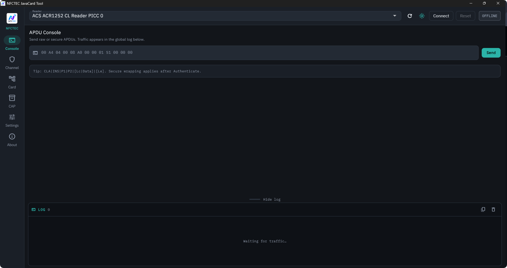
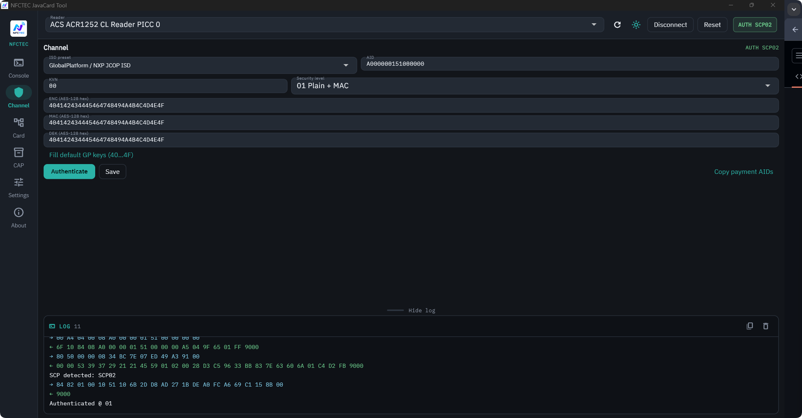
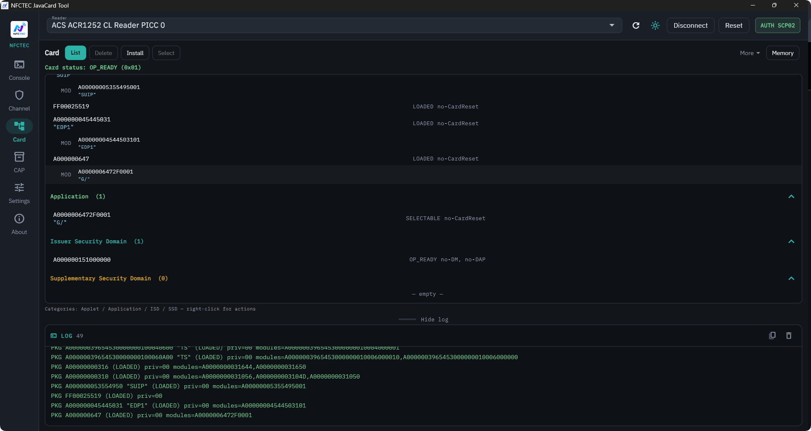

# NFCTEC-JAVACARD-TEST-TOOL

Java Card work usually means several tools at once: a GlobalPlatform shell for the secure channel, another utility for CAP load, and a console for raw APDUs. **NFCTEC JavaCard Tool** puts those steps in one desktop host so you can authenticate, inspect the card, load a package, and debug APDUs without switching windows.

Connect a PC/SC reader, select the Issuer Security Domain, and authenticate with ENC / MAC / DEK. The tool detects **SCP02** or **SCP03** from the card, then wraps later commands according to the security level you chose (plain, MAC, or ENC + MAC).

From there you can list applets, applications, the ISD and SSDs; drop a `.cap` file to parse and download; read CPLC; probe free memory; put keys; or send hex APDUs from the console. Invalid CAP files are rejected before anything is sent to the card.

Version 1.2.0 is built for PC/SC readers on Windows. It targets development, sample bring-up, and small-batch personalization — a practical bench tool, not a factory CMS.

Download: [`NFCTEC_JavaCard_Tool_Setup_1.2.0.exe`](./NFCTEC_JavaCard_Tool_Setup_1.2.0.exe)

## Screenshots

### APDU Console

Send hex APDUs and watch traffic in the live log. After authentication, wrapping follows the current security level. Auto GET RESPONSE handles `61xx` / `6Cxx`.

### Secure channel

Pick an ISD AID, set KVN and security level, enter ENC / MAC / DEK, then Authenticate. The header shows `AUTH SCP02` or `AUTH SCP03` when the session is open.

### Card registry

List packages, applets, applications, ISD and SSD from GET STATUS. Right-click to Select, Delete, Lock / Unlock, or Install. Card Info reads CPLC (`9F7F`).

## About [nfctec.com](https://www.nfctec.com)

[NFCTEC](https://www.nfctec.com) is a full-stack NFC and smart card company. We co-develop software, design hardware, and connect cloud backends — from first prototype to certified mass production.

**What we cover**

- **Software** — mobile wallet SDKs, issuance and reading software for ePassports, bank cards (EMV), NTAG 424 DNA, DESFire, MIFARE, FeliCa, JavaCard and more
- **Hardware** — USB / Serial / USB CCID readers, embedded modules, NFC field detector cards, antennas and blank cards
- **Cloud** — issuance and verification APIs, HSM-backed keys and SaaS consoles
- **Industry solutions** — payment, transit, identity, access control and IoT

**Focus areas include** banking & payment, transit & ticketing, government & ID, access control, healthcare, IoT, brand protection, retail & loyalty, automotive, mobile wallet, and security / crypto wallets.

This JavaCard Tool is part of that stack: a Windows GlobalPlatform host for SCP02/SCP03, CAP load, CPLC readout, and APDU debugging.

Learn more, request samples, or talk to the engineering team: **[https://www.nfctec.com](https://www.nfctec.com)**
